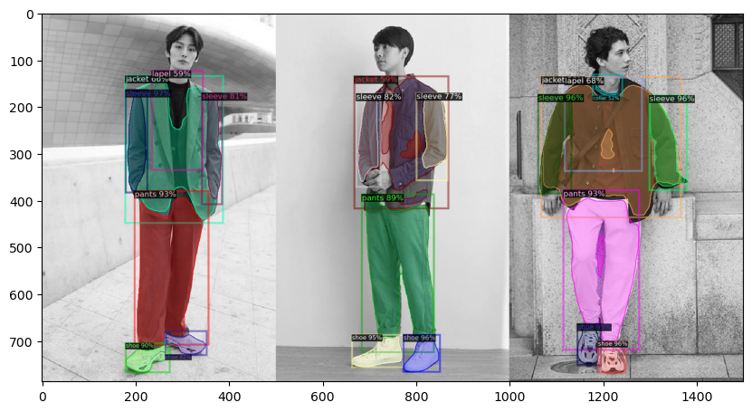

# Fashion-visualizer
## Introduction

> 


> [!NOTE] 
> 10,000 iterations have been passed so far

This is a Fashion-visualizer based on finetuned detectron2 model with iMaterialist FGVC7 dataset.

- [Detectron2]("https://github.com/facebookresearch/detectron2/tree/main") is an open-source object detection and segmentation framework developed by Meta. It provides a flexible and extensible platform for building and training state-of-the-art models for various computer vision tasks, including object detection, instance segmentation, and semantic segmentation.
- [iMaterialist FGVC7]("https://www.kaggle.com/c/imaterialist-fashion-2020-fgvc7") is a large-scale fashion dataset created for the Fashion and Apparel Classification Challenge. It consists of a diverse collection of fashion images sourced from various e-commerce platforms and annotated with fine-grained labels.

## Requirements

First you need to install detectron2 package, you can follow [detectron2 official installation]("https://detectron2.readthedocs.io/en/latest/tutorials/install.html") or the code down below copy from installation page.
```
python -m pip install 'git+https://github.com/facebookresearch/detectron2.git'
# (add --user if you don't have permission)

# Or, to install it from a local clone:
git clone https://github.com/facebookresearch/detectron2.git
python -m pip install -e detectron2

# On macOS, you may need to prepend the above commands with a few environment variables:
CC=clang CXX=clang++ ARCHFLAGS="-arch x86_64" python -m pip install ...
```

Then use `pip install -r requirements.txt` to install package from requirements.txt file.

> [!NOTE]
>Because of github LFS bandwidth limit, so I put the .pth files on my google-drive where you can download and put into config folder straightly. 2024/5/20 [Download link](https://drive.google.com/drive/folders/1A4bHDKO4idvPCI69rpwVZwnMJ48FTD_M?usp=sharing)

## How to use

Using CLI to interact with visualizer.

**Command line interface**
```
usage: Fashion-visualizer.py [-h] [--pt PT] [--th TH] [--wt WT] [--md MD]

--- Fashion-visualizer ---

options:
  -h, --help  show this help message and exit
  --pt PT     Input image path
  --th TH     Prediction thershold
  --wt WT     Model weight file(V1)
  --md MD     Metadata json path
```

### Basic usage

Set predict image path.
```
python Fashion-visualizer.py --pt /YOUR_IMAGE_PATH
```

Adjust the threshold for the prediction, which defaults to **0.7**, also can change the weight file of the model.
```
python Fashion-visualizer.py --pt /YOUR_IMAGE_PATH --th 0.8 --wt V2
```

## In progress

In the future, models with more iterations will be released, so you can change the model weight file for different use cases.

**Model list**

:heavy_check_mark: modelV1 - 1,000 passed iteration   
:heavy_check_mark: modelV2 - 5,000 passed iteration  
:heavy_check_mark: modelV3 - 10,000 passed iteration  
- [ ] modelV4 - 20,000 passed iteration


## License

```plaintext
MIT License

Copyright (c) 2024 Jsnn

Permission is hereby granted, free of charge, to any person obtaining a copy
of this software and associated documentation files (the "Software"), to deal
in the Software without restriction, including without limitation the rights
to use, copy, modify, merge, publish, distribute, sublicense, and/or sell
copies of the Software, and to permit persons to whom the Software is
furnished to do so, subject to the following conditions:

The above copyright notice and this permission notice shall be included in all
copies or substantial portions of the Software.

THE SOFTWARE IS PROVIDED "AS IS", WITHOUT WARRANTY OF ANY KIND, EXPRESS OR
IMPLIED, INCLUDING BUT NOT LIMITED TO THE WARRANTIES OF MERCHANTABILITY,
FITNESS FOR A PARTICULAR PURPOSE AND NONINFRINGEMENT. IN NO EVENT SHALL THE
AUTHORS OR COPYRIGHT HOLDERS BE LIABLE FOR ANY CLAIM, DAMAGES OR OTHER
LIABILITY, WHETHER IN AN ACTION OF CONTRACT, TORT OR OTHERWISE, ARISING FROM,
OUT OF OR IN CONNECTION WITH THE SOFTWARE OR THE USE OR OTHER DEALINGS IN THE
SOFTWARE.
```


